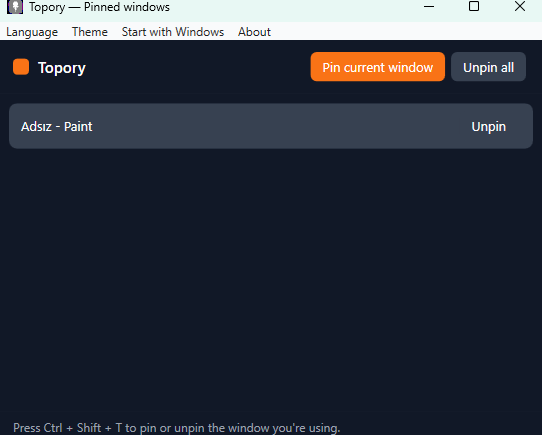

# Topory

**English | [Türkçe](README.tr.md)**

A lightweight Windows "always on top" manager.

Topory lives quietly in your system tray. Press a hotkey and the window you're
using is pinned above everything else — great for keeping a video, notes, a
reference, or a calculator visible while you work. Press it again to unpin. A
small window lists everything you've pinned so you can release them one by one.

<p align="center">
  
</p>

## Features

- **Pin on top** — global hotkey (`Ctrl + Shift + T`) keeps the focused window
  above all others; press again to unpin.
- **Works on any window** — toggles the window's own "topmost" flag, so it stays
  on top even after Topory is closed (and Topory releases everything on quit).
- **Pinned list** — a window shows what's currently pinned; unpin one or all.
- **Dark or light** — pick a **System**, **Dark**, or **Light** theme from the
  menu. Defaults to **System**, following your Windows setting.
- **Start with Windows** — optional, toggled from the menu.
- **English & Turkish** — switch the interface language from the menu.
- **Private by design** — everything stays on your machine; nothing is uploaded.

## Run it

Topory isn't published as a prebuilt download yet, so for now you run it from
source. You'll need the [.NET 8 SDK](https://dotnet.microsoft.com/download/dotnet/8.0)
(the SDK, not just the runtime) on Windows.

```bash
git clone https://github.com/volkanturhan/Topory.git
cd Topory
dotnet run --project Topory/Topory.csproj
```

Topory starts quietly in the system tray — **no window pops up**. That's normal;
use the hotkey, or double-click the tray icon to see your pinned windows.

## How to use

1. Launch Topory — it starts quietly in the system tray.
2. Click the window you want to keep visible, then press **`Ctrl + Shift + T`**
   (or pick **Pin current window** from the tray). It's now on top of everything.
3. Press **`Ctrl + Shift + T`** again over that window to unpin it.
4. Double-click the tray icon (or **Pinned windows**) to see everything you've
   pinned — **Unpin** one, or **Unpin all**.

Right-click the tray icon for **Pin current window**, **Pinned windows**, **Start
with Windows**, language, and **Quit**. Quitting releases every pinned window.

## Build a shareable exe

Want a standalone `.exe` you can hand to someone without the SDK? Build it
yourself — the output isn't checked into the repo:

```bash
# Builds into dist/ (self-contained Topory.exe + lite build)
pwsh tools/publish.ps1
```

## Tech

- C# / WPF on .NET 8 (Windows)
- No third-party dependencies

## License

MIT — see [LICENSE](LICENSE).
