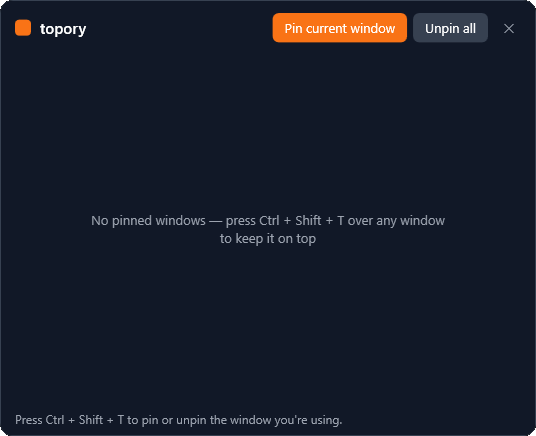
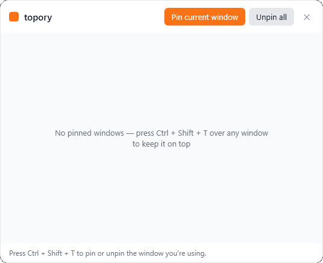

# topory

**[English](README.md) | Türkçe**

Hafif bir Windows "her zaman üstte" yöneticisi.

topory sistem tepsisinde sessizce durur. Bir kısayola bas, kullandığın pencere
diğer her şeyin üstüne sabitlensin — çalışırken bir videoyu, notları, bir
referansı ya da hesap makinesini görünür tutmak için birebir. Tekrar bas,
sabitleme kalksın. Küçük bir pencere sabitlediklerini listeler, tek tek bırakabilirsin.

<p align="center">
  
  
</p>

## Özellikler

- **Üstte sabitle** — global kısayol (`Ctrl + Shift + T`) odaktaki pencereyi her
  şeyin üstünde tutar; tekrar bas, kalksın.
- **Her pencerede çalışır** — pencerenin kendi "en üstte" bayrağını değiştirir,
  böylece topory kapansa bile üstte kalır (topory çıkışta hepsini serbest bırakır).
- **Sabitlenenler listesi** — bir pencere o an sabitli olanları gösterir; tek tek
  ya da tümünü birden kaldır.
- **Koyu ya da açık** — menüden **Sistem**, **Koyu** ya da **Açık** temasını seç.
  Varsayılan **Sistem**, yani Windows ayarını takip eder.
- **Windows ile başla** — isteğe bağlı, menüden aç/kapa.
- **Kendini günceller** — yeni sürüm çıktığında topory'i tepsiden önerir; tek tıkla kurulur.
- **İngilizce & Türkçe** — arayüz dilini menüden değiştir.
- **Tasarımı gereği gizli** — her şey senin makinende kalır, hiçbir şey yüklenmez.

## İndir

En güncel sürümü [**Releases**](https://github.com/volkanturhan/topory/releases/latest) sayfasından indir:

- **topory-setup-…exe** — kurulum (önerilen). Yönetici izni gerekmez ve topory bundan sonra kendini güncel tutar.
- **topory-…exe** — taşınabilir tek dosya; çalıştır yeter, kurulum yok.

İkisi de self-contained, yani .NET kurulu olması gerekmez. Windows 10/11, 64-bit.

topory sessizce sistem tepsisinde başlar — **hiçbir pencere açılmaz**. Bu
normaldir; kısayolu kullan ya da sabitlediklerini görmek için tepsi ikonuna çift tıkla.

## Kaynaktan çalıştır

Kendin derlemeyi mi tercih edersin? Windows'ta [.NET 8 SDK](https://dotnet.microsoft.com/download/dotnet/8.0)
(sadece runtime değil, SDK) kurulu olmalı.

```bash
git clone https://github.com/volkanturhan/topory.git
cd topory
dotnet run --project topory/topory.csproj
```

## Nasıl kullanılır

1. topory'i başlat — sessizce sistem tepsisine yerleşir.
2. Görünür tutmak istediğin pencereye tıkla, sonra **`Ctrl + Shift + T`**'ye bas
   (ya da tepsiden **Geçerli pencereyi sabitle**). Artık her şeyin üstünde.
3. Aynı pencerenin üzerindeyken **`Ctrl + Shift + T`**'ye tekrar bas, kalksın.
4. Tepsi ikonuna çift tıkla (ya da **Sabitlenen pencereler**): sabitlediklerini
   gör — birini **Sabitlemeyi kaldır** ya da **Tümünü kaldır**.

Tepsi ikonuna sağ tık: **Geçerli pencereyi sabitle**, **Sabitlenen pencereler**,
**Windows ile başlat**, dil ve **Çıkış**. Çıkış, sabitlenen tüm pencereleri serbest bırakır.

## Paylaşılabilir exe oluştur

SDK olmadan birine verebileceğin bağımsız bir `.exe` ve kurulum dosyası mı
istiyorsun? Kendin derle — çıktı repoya dahil edilmez:

```bash
# dist/release içine derler (taşınabilir topory.exe + Windows kurulumu)
pwsh tools/release.ps1
```

## Teknoloji

- C# / WPF, .NET 8 (Windows)
- Üçüncü parti bağımlılık yok

## Lisans

MIT — bkz. [LICENSE](LICENSE).
